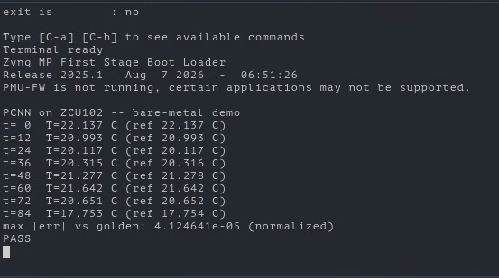
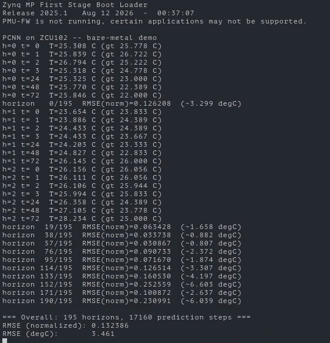
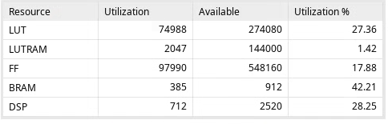

# Results

## Golden-model verification

C-simulation against the PyTorch golden reference over one 96-step horizon, reproducible from a clean checkout with `./pcnn_sim`:

```
max |err| over T,D,E: 4.762e-05   (T only: 4.119e-05)
TEST PASSED
```

The on-board bare-metal run reports **4.124641e-05** on the same sequence — the C-sim and the synthesized hardware agree to five significant figures, which is the real result here: the HLS design, the RTL, and the host arithmetic all behave identically.



In normalized units 4.1e-05 is roughly **0.001 °C**. Residual error comes from the sigmoid LUT interpolation and float reassociation in the parallelized dot products, not from any structural difference to the PyTorch model.

## Real-world validation — Harvard SEC

The model was trained on synthetic EnergyPlus data (`Mid.csv`) and evaluated **zero-shot** on 14 months of real building-management-system data from room 5.417 of Harvard's Science & Engineering Complex, running on the board:

```
=== Overall: 195 horizons, 17160 prediction steps ===
RMSE (normalized): 0.132386
RMSE (degC):       3.461
```



Per-horizon RMSE spans roughly **0.8 °C** (best) to **6.6 °C** (worst). That spread is the simulated-to-real domain gap, not an accelerator defect — the same vectors through the GCC build give the same answers. Treat 3.46 °C as the transfer-learning baseline to beat.

## Resource utilization

Post-implementation on the XCZU9EG at 100 MHz, all timing met (**WNS +2.625 ns**):

| Resource | Used | Available | Utilization |
|---|---|---|---|
| LUT | 74,988 | 274,080 | 27.36% |
| LUTRAM | 2,047 | 144,000 | 1.42% |
| FF | 97,990 | 548,160 | 17.88% |
| BRAM | 385 | 912 | 42.21% |
| DSP | 712 | 2,520 | 28.25% |



**BRAM is the binding resource** at 42%, because all ~1.4 M float32 weights are held on-chip. DSP sits at 28% only because of the deliberate caps described in [architecture.md](architecture.md) — the unconstrained design over-ran the device's 2,520 DSPs. There is headroom in LUT and FF, so a wider datapath is feasible if the DSP budget is spent more carefully; there is *not* much headroom for a larger model without moving weights off-chip.

## Screenshots

| File | What it shows |
|---|---|
| `photos/block-design.png` | Vivado block design: MPSoC + Pcnn_step + SmartConnect |
| `photos/design-timing.png` | Post-implementation timing summary |
| `photos/hls-resources.png` | HLS performance & resource estimates (an earlier solution — the DSP figure there is the over-utilization that motivated PAR=4) |
| `photos/vivado-utilization.png`, `vivado-util-summary.png` | Final post-implementation utilization |
| `photos/unroll-pcnn-results.png` | On-board golden-model run |
| `photos/unroll-pcnn-results-NEW-DATA.png` | On-board Harvard dataset run, all 195 horizons |

## Not measured

Per-step latency has never been recorded for the final design. `main.c` has no timing instrumentation, and the only latency figure in the repo (`photos/hls-resources.png`, ~3.07 ms) belongs to an older solution with a different tanh implementation, so it does not describe the current design. Wrap the `pcnn_step` call in `main.c` with `XTime_GetTime()` to get a trustworthy number before quoting one.
